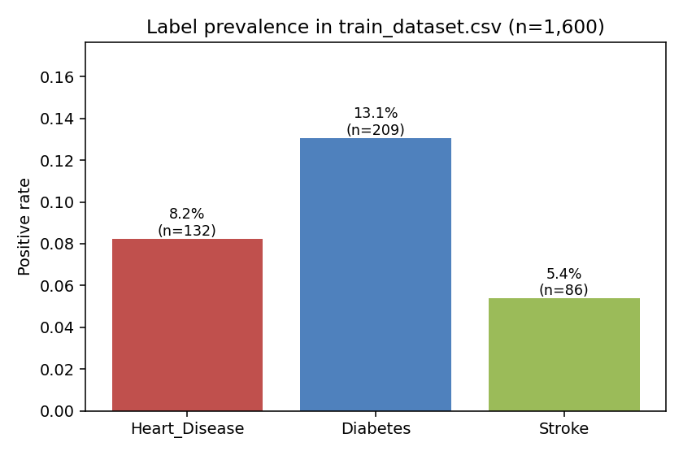
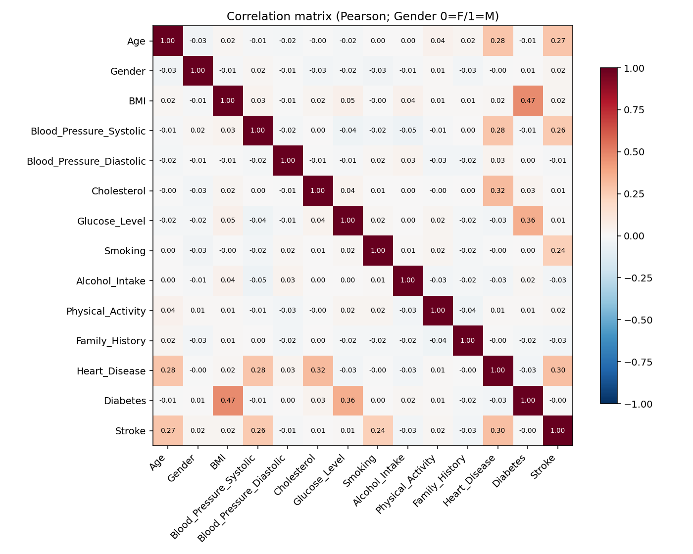
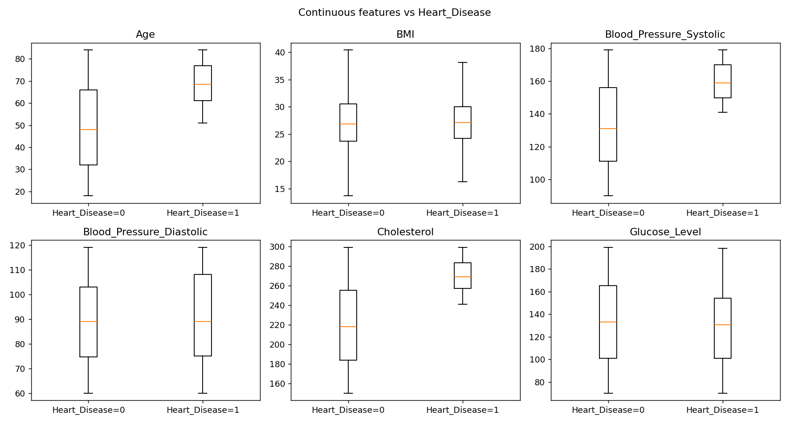
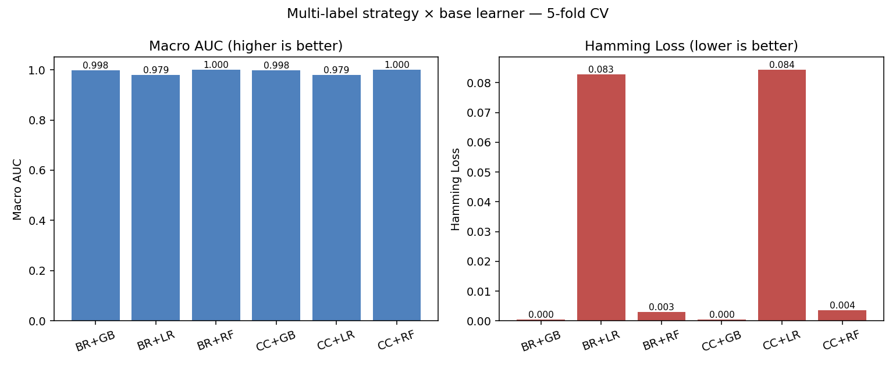
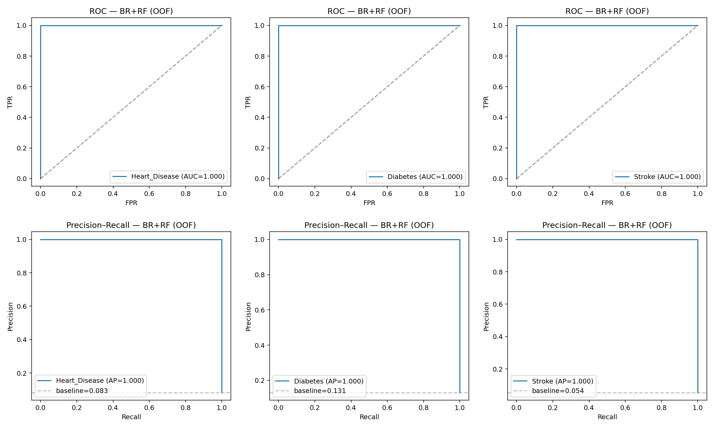
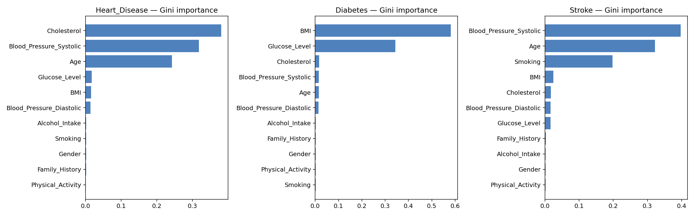
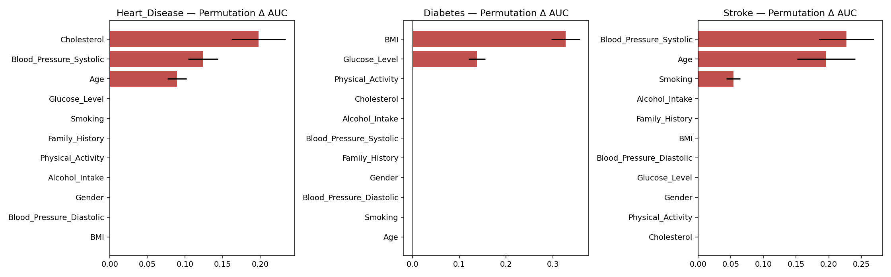
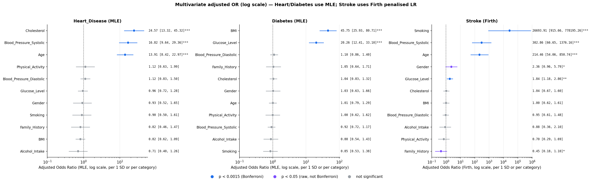

# 使用臨床特徵同時預測心血管、糖尿病與中風風險：以多標籤學習結合臨床風險因子量化分析
### 智慧醫療與應用 期中報告

授課教師：Albert C. Yang, M.D., Ph.D.
助教：Yu-Chieh Chen
報告日期：2026-05-14

---

## 摘要 (Abstract)

本研究以 1,600 筆病患資料同時建立 `Heart_Disease`、`Diabetes`、`Stroke` 三個二元標籤的多標籤分類模型。我們比較了 **Binary Relevance (BR)** 與 **Classifier Chains (CC)** 兩種多標籤策略，搭配 `Logistic Regression`、`Random Forest`、`Gradient Boosting` 三種基礎分類器；以 5-fold stratified CV 評估，最終以 `BR + Random Forest` 為最佳模型（Macro AUC = 1.000, Hamming Loss = 0.003）。在 ML 預測之外，本報告於 Methods 加上 **Quantitative Risk-Factor Analysis (QRFA)**——以 logistic regression 計算單變量／多變量 odds ratio，並對 `Stroke` 採用 **Firth penalised logistic regression** 解決準分離問題。RF permutation importance 與 QRFA 使用同一份資料，不能視為真正獨立驗證；但兩種不同建模假設下得到一致的特徵排序，可作為同資料內的 robustness check。關鍵風險因子為：心臟病 Cholesterol / SBP / Age，糖尿病 BMI / Glucose，中風 Age / SBP / Smoking / Glucose。

---

## 1. Introduction

心血管疾病、糖尿病與中風是臨床上常見且彼此高度相關的慢性病。三者共享許多風險因子（年齡、肥胖、高血壓、高血糖、膽固醇異常、吸菸與生活型態），同一位病人同時具有多種疾病風險並不少見。**多標籤分類 (multi-label classification)** 與「為每個疾病各別訓練一個模型」相比，更貼近臨床實務中「同時評估多重共病風險」的需求，也允許模型考量標籤間的條件依存關係。

本專題的目標有兩個：

1. **預測層面**：建立一個可同時預測 `Heart_Disease`、`Diabetes`、`Stroke` 的多標籤模型，並比較 BR 與 CC 兩種策略。
2. **解釋層面**：以 logistic regression 進行 **量化風險因子分析 (Quantitative Risk-Factor Analysis)**，量化每個臨床特徵對個別疾病的獨立影響力（adjusted OR / 95% CI / p-value），並與 ML 模型的特徵重要度比較，作為同資料內的穩健性檢查。

---

## 2. Methods

### 2.1 資料來源與欄位

來源為 Kaggle 的 `rafi003/healthcare-disease-prediction-dataset`。助教提供 `train_dataset.csv` 共 1600 筆 (80%)，包含 11 個特徵欄位與 3 個目標欄位：

| 類型 | 欄位 |
|---|---|
| 連續型特徵 | `Age`, `BMI`, `Blood_Pressure_Systolic`, `Blood_Pressure_Diastolic`, `Cholesterol`, `Glucose_Level` |
| 二元特徵 | `Gender` (Male=1, Female=0), `Smoking`, `Alcohol_Intake`, `Physical_Activity`, `Family_History` |
| 目標標籤 | `Heart_Disease`, `Diabetes`, `Stroke` |

`Patient_ID` 僅作病患識別碼，**不納入特徵**。`Gender` 在原始 CSV 中為字串 `Male` / `Female`，明確編碼為 1/0。

### 2.2 資料探索

三個標籤均為高度不平衡的二元變數（圖 2.1）：



**表 2.1　標籤盛行率與兩兩共病人數**

| 標籤 | 盛行率 | 陽性人數 |
|---|---|---|
| `Heart_Disease` | 8.25% | 132 / 1600 |
| `Diabetes` | 13.06% | 209 / 1600 |
| `Stroke` | 5.38% | 86 / 1600 |

| 共病組合 | 人數 |
|---|---|
| Heart_Disease ∩ Diabetes | 13 |
| Heart_Disease ∩ Stroke | 37 |
| Diabetes ∩ Stroke | 11 |

特徵間的線性相關性整體偏低（圖 2.2），表示原始特徵彼此提供的訊息相對獨立，也預先暗示多重共線性 (multicollinearity) 在後續多變量 logistic regression 中應該不會嚴重。不過在臨床資料中，BMI、血壓、血糖與膽固醇通常不會近乎完全正交；因此這個現象也被視為資料可能具有合成規則的訊號之一，於 Discussion §4.6 再討論。



各疾病陽／陰性兩群在主要連續特徵上的分布差異可見於圖 2.3（以 `Heart_Disease` 為例），其餘兩個疾病的版本見 `figures/boxplot_Diabetes.png` 與 `figures/boxplot_Stroke.png`。



### 2.3 前處理

連續特徵以 `StandardScaler` 標準化、二元特徵直接 pass-through，整體前處理與分類器共同包裝在同一個 `sklearn.Pipeline` 中，以避免任何在 fold 切割之前就「看到」測試資料的洩漏。

### 2.4 多標籤建模策略

| 策略 | 說明 |
|---|---|
| **Binary Relevance (BR)** | 將三個標籤視為三個彼此獨立的二元分類問題，分別訓練。 |
| **Classifier Chains (CC)** | 將前一個標籤的預測值串入後一個標籤的特徵集，明確捕捉標籤依存。鏈順序固定為 `[Heart, Diabetes, Stroke]`。 |

兩種策略 × 三個基礎分類器 (`LR`, `RF`, `GB`) = 共 **6 組模型** 比較。CC 僅使用上述固定鏈順序；本報告沒有進一步測試 random chain order 或 ensemble of classifier chains，因此 BR 與 CC 的比較限於此設定。

### 2.5 評估方式

採 **5-fold stratified cross-validation**，分層依據為三個標籤的聯合組合 (joint label string)，以盡量維持各 fold 的標籤結構一致。指標包括：

- 每個標籤的 ROC AUC、Average Precision (AP)
- Macro AUC、Micro AUC
- **Hamming Loss**（題目指定）
- Macro F1、Micro F1

二元判定的決策閾值固定為 0.5（sklearn 預設）。AUC 與 AP 不依賴閾值，但 Hamming Loss 與 F1 會；本資料因 AUC 已達 1.000，閾值的選擇對結果影響有限，但仍在此明確記錄以利重現。

模型選擇原則：先以 Macro AUC 排序，遇平手再以 Hamming Loss 較低者為佳。

### 2.6 Quantitative Risk-Factor Analysis (QRFA)

在 ML 模型之外，本報告以 **logistic regression 量化每個臨床特徵對個別疾病的獨立影響力**。這對應於作業要求中 "identify the most influential clinical features per disease" 的部分，並提供 ML 黑箱模型外的可解釋對照。

**設計：**

1. **單變量 logistic regression**：對每個 (target, feature) 配對單獨建模，得到 unadjusted OR / 95% CI / p-value，反映「總效應」。
2. **多變量 logistic regression**：以全部 11 個特徵為共變量同時建模，得到 **adjusted OR**，反映「條件於其他 10 個變數的獨立效應」。
3. **共線性診斷**：以 Variance Inflation Factor (VIF) 檢查多變量模型的數值穩定性；若 VIF 異常接近 1，也作為判讀資料合成性的輔助訊號。
4. **多重檢定校正**：由於 `Heart_Disease`、`Diabetes` 使用 MLE Wald p-value，而 `Stroke` 使用 Firth likelihood-ratio p-value，正式詮釋以每個 target 內部 11 個檢定為 family；表格與圖中的「保守標記」（p < 0.0015，約等同 33 個檢定的 0.05/33 門檻）僅作描述性參考，BH-FDR 作為輔助判讀。
5. **事前中介假設檢查**：針對「BMI → SBP → Stroke」、「BMI → SBP → Heart_Disease」、「BMI → Glucose → Diabetes」三條事前假設路徑，計算加入中介因子後 exposure OR 的變化。此分析目的不是強行建立中介模型，而是檢驗這些臨床直覺路徑是否被資料支持。
6. **準分離處理**：標準 MLE 對 `Stroke` 模型出現準分離 (quasi-separation)——`Smoking` 的 OR 趨於無限大、CI 為 [0, ∞]。我們對 `Stroke` 改採 **Firth penalised logistic regression**（Heinze & Schemper 2002），其於 log-likelihood 中加入 Jeffreys prior 懲罰項 $\tfrac{1}{2} \log |I(\beta)|$，可在分離條件下仍給出有限的點估計。`Stroke` 的顯著性以 Firth likelihood-ratio p-value 判讀，CI 則作為描述性區間；在分離資料中，極小 p-value 與很寬的 CI 可同時出現。

連續特徵均事先標準化，因此 OR 為「**每增加 1 SD 的 odds 倍數變化**」，可在不同單位的特徵間直接比較大小；二元特徵則為「比較類別 1 vs 0 的 odds ratio」。本資料中 1 SD 約等於：Age 19.5 years、BMI 4.9 kg/m²、SBP 26.1 mmHg、DBP 17.0 mmHg、Cholesterol 43.3 mg/dL、Glucose 36.7 mg/dL。這些換算對臨床解讀很重要，因為表中的 OR 不是「每 1 單位」變化。

### 2.7 正式測試集

助教於 **2026-05-07 10:00** 釋出 `data/test.csv`，共 400 筆僅含特徵的測試集（不含三個目標欄位），用於最終評分。本報告 §3.6 報告此測試集上的預測分佈與信心度分析；最終 AUC / Hamming 等指標仍以助教評分為準。

---

## 3. Results

### 3.1 5-fold cross-validation 結果

**表 3.1　六組模型的 5-fold CV 平均成績**

| Strategy | Base | Macro AUC | AUC Heart | AUC Diabetes | AUC Stroke | Hamming Loss | Macro F1 |
|----------|------|-----------|-----------|--------------|------------|--------------|----------|
| BR | LR | 0.9792 | 0.9731 | 0.9717 | 0.9927 | 0.0829 | 0.6700 |
| CC | LR | 0.9793 | 0.9731 | 0.9720 | 0.9929 | 0.0844 | 0.6631 |
| BR | GB | 0.9975 | 0.9926 | 1.0000 | 1.0000 | 0.0004 | 0.9974 |
| CC | GB | 0.9975 | 0.9926 | 1.0000 | 1.0000 | 0.0004 | 0.9974 |
| **BR** | **RF** | **1.0000** | **1.0000** | **1.0000** | **1.0000** | **0.0029** | **0.9773** |
| CC | RF | 1.0000 | 1.0000 | 1.0000 | 1.0000 | 0.0035 | 0.9715 |

依 Macro AUC 最高、Hamming Loss 較低的原則選定 **BR + Random Forest**，其設定保存在 `model.joblib`。視覺化的模型比較見圖 3.1。



### 3.2 ROC / Precision-Recall 曲線

最佳模型 (BR + RF) 在三個標籤上的 OOF (out-of-fold) ROC 與 PR 曲線並列如下（上排為 ROC、下排為 PR；左→中→右為 Heart / Diabetes / Stroke）：



三個標籤的 ROC 曲線都緊貼左上角、PR 曲線都接近水平 1.0，AUC 與 AP 同時達到 1.000——這既是模型擬合能力強的訊號，也提示資料本身可能具有強烈規則性（詳見 Discussion §4.5）。

### 3.3 ML 特徵重要度（Random Forest）

從最終 BR + RF 模型可萃取兩種特徵重要度：

- **Gini importance**（圖 3.3a）：基於樹節點切割不純度下降的累積，對相關特徵會有偏向。
- **Permutation importance**（圖 3.3b）：直接以「打亂某個特徵會使 AUC 下降多少」為衡量基準，是 model-agnostic 的金標準。




兩種方法在「每個疾病的前 2–3 名」上幾乎一致：

| 疾病 | Permutation importance 排序前三 |
|---|---|
| `Heart_Disease` | **Cholesterol** (0.198), **SBP** (0.124), **Age** (0.090) |
| `Diabetes` | **BMI** (0.327), **Glucose** (0.138)；其餘特徵 ≈ 0 |
| `Stroke` | **SBP** (0.227), **Age** (0.196), **Smoking** (0.054) |

其餘特徵的 permutation 重要度都接近數值 0（10⁻¹⁷ 等級的浮點誤差），意味著最終 RF 模型實際上只用了少數幾個關鍵特徵就能近乎完全分類。

### 3.4 Quantitative Risk-Factor Analysis（OR、95% CI、p-value）

**VIF 結果：** 所有 11 個特徵在三個多變量模型中的 VIF 皆 ≈ 1.0（最大值 1.008），遠低於 5.0 的警戒值，因此多變量模型在數值上沒有共線性問題。不過 VIF 幾乎等於 1.0 也表示特徵間近乎正交，這在真實臨床資料中並不常見，較像合成資料的生成痕跡；因此本結果同時放入 §4.6 作為資料限制討論。

#### 3.4.1 Forest plots（adjusted OR with 95% CI）



各疾病單獨的高解析版本可見 `figures/forest_Heart_Disease.png`、`figures/forest_Diabetes.png`、`figures/forest_Stroke.png`。圖中藍色點代表保守標記（p < 0.0015，約等同 33 個檢定的 0.05/33 門檻）、紫色為原始 p < 0.05 的探索性關聯、灰色為不顯著；箭頭表示 CI 上界超出顯示範圍。需注意：`Heart_Disease` 與 `Diabetes` 的 p-value 為 MLE Wald p-value，`Stroke` 為 Firth likelihood-ratio p-value，三者不應被視為完全相同型態的檢定。

#### 3.4.2 Heart_Disease

**表 3.2　Heart_Disease 的單變量與多變量 OR**

| Feature | OR (uni) | OR adj [95% CI] | p_adj | 保守標記 |
|---|---|---|---|---|
| **Age** | 3.51 | **13.91 [8.42, 22.97]** | <0.001 | ✔ |
| **SBP** | 3.67 | **16.82 [9.64, 29.36]** | <0.001 | ✔ |
| **Cholesterol** | 5.14 | **24.57 [13.32, 45.32]** | <0.001 | ✔ |
| BMI | 1.06 | 0.82 [0.62, 1.09] | 0.169 | — |
| DBP | 1.13 | 1.12 [0.83, 1.50] | 0.461 | — |
| Glucose | 0.91 | 0.96 [0.72, 1.28] | 0.766 | — |
| Gender / Smoking / Alcohol / PA / FamHx | 接近 1 | 接近 1 | > 0.2 | — |

#### 3.4.3 Diabetes

**表 3.3　Diabetes 的單變量與多變量 OR**

| Feature | OR (uni) | OR adj [95% CI] | p_adj | 保守標記 |
|---|---|---|---|---|
| **BMI** | 8.16 | **45.75 [25.93, 80.71]** | <0.001 | ✔ |
| **Glucose** | 3.90 | **20.26 [12.41, 33.10]** | <0.001 | ✔ |
| 其餘 9 個特徵 | ~1 | 0.85 ~ 1.10 | 全部 > 0.4 | — |

#### 3.4.4 Stroke（Firth-corrected）

標準 MLE 對 `Stroke` 的 `Smoking` 出現準分離（β 趨於發散，OR ≈ 10¹⁴，CI 為 [0, ∞]），因此改以 Firth penalised LR 重估。MLE 與 Firth 並列比較見表 3.4。

**表 3.4　Stroke：MLE vs Firth penalised logistic regression**

| Feature | MLE OR [95% Wald CI] | Firth result | Firth p | 保守標記 |
|---|---|---|---|---|
| **Age** | 401 [79, 2023] | **214 [54, 851]** | <0.001 | ✔ |
| **SBP** | 598 [101, 3548] | **303 [67, 1376]** | <0.001 | ✔ |
| **Smoking** | **non-finite (10¹⁴, CI [0, ∞])** | **OR ≫ 1**（near-separation；量級不解讀） | <0.001 | ✔ |
| **Glucose** | 1.97 [1.22, 3.18] | **1.84 [1.18, 2.86]** | 0.001 | ✔ |
| Gender | 2.64 [1.00, 6.98] | 2.36 [0.96, 5.79] | 0.022 | — (FDR ✔) |
| Family_History | 0.40 [0.15, 1.07] | 0.45 [0.18, 1.10] | 0.030 | — (FDR ✔) |
| BMI / DBP / Chol / Alcohol / PA | 接近 1 | 接近 1 | > 0.08 | — |

對照 MLE 與 Firth 兩欄的 CI 寬度（Age：[79, 2023] → [54, 851]；SBP：[101, 3548] → [67, 1376]）可見 Firth 修正在不犧牲方向性的前提下，把 Wald CI 從跨多個數量級收窄到較合理的區間，並把 Smoking 從 non-finite 拉回有限值。

**通過保守標記的中風關聯因子為 Age、SBP、Smoking、Glucose 四項；** Gender 與 Family_History 僅在 BH-FDR 條件下顯著，且 `Family_History` 的方向為保護性（OR < 1），不符合一般臨床直覺，因此僅列為合成資料中的探索性關聯，不解讀為真實保護因子。

#### 3.4.5 事前中介假設檢查

**表 3.5　事前中介假設檢查（attenuation 為加入 mediator 後 exposure OR 朝 1 收斂的百分比）**

| Outcome | Exposure | Mediator | OR_total (p) | OR_direct given mediator (p) | Attenuation |
|---|---|---|---|---|---|
| Stroke | BMI | SBP | 1.11 (p=0.330) | 1.06 (p=0.618) | 47.0% |
| Heart_Disease | BMI | SBP | 1.06 (p=0.511) | 1.02 (p=0.846) | 69.4% |
| Diabetes | BMI | Glucose | 8.16 (p<0.001) | 44.03 (p<0.001) | **−501%**（反向放大） |

三條事前假設的結果都是「不支持中介解釋」，這本身是本段的結論。於 `Stroke`、`Heart_Disease` 兩個 outcome 上，BMI 的單變量總效應原本就**未達統計顯著**（p > 0.3），因此「加入 SBP 後 OR 衰減」的解讀**不能寫成「中介效果」**——兩個都不顯著的 OR 互相比較，47% 與 69% 的 attenuation 在統計意義上不成立。對 `Diabetes`，加入 Glucose 後 BMI 的 OR 反而**放大**（8.16 → 44.03），這是 collider/suppressor 的訊號，亦不能解讀為中介；其臨床意涵見 Discussion §4.4。

### 3.5 ML 特徵重要度與 QRFA OR 的穩健性檢查

RF permutation importance 與 QRFA OR 使用同一份資料、同一組特徵與同一組標籤，因此不是統計上獨立的外部驗證。較精確的解讀是：在樹模型與 logistic regression 這兩種不同建模假設下，主要特徵排序仍相當一致（表 3.6），因此可作為同資料內的 robustness check。

**表 3.6　兩種建模假設下的「前幾名」風險因子比對**

| 疾病 | RF Permutation top | QRFA 支持的主要特徵 |
|---|---|---|
| Heart_Disease | Cholesterol, SBP, Age | Cholesterol, SBP, Age |
| Diabetes | BMI, Glucose | BMI, Glucose |
| Stroke (Firth) | SBP, Age, Smoking | Age, SBP, Smoking, Glucose* |

*中風中 Glucose 的線性 OR (1.84) 雖小但顯著，而 RF permutation 接近 0——顯示 Glucose 在中風的影響在這份資料中以 *線性、單調* 為主，而非樹模型擅長捕捉的高階交互或門檻式效應，因此 RF 在已有 SBP+Age+Smoking 條件下不再依賴 Glucose 也能正確分類。

### 3.6 正式測試集 test.csv 上的預測

助教於 2026-05-07 釋出 `data/test.csv`（400 筆，僅特徵），最終模型對其推論結果存於 `outputs/predictions.csv`，欄位為 `Patient_ID, Heart_Disease, Diabetes, Stroke, *_proba`。由於該測試集**不含 ground truth 標籤**，無法直接計算 AUC / Hamming 等指標；本節僅報告預測分佈與信心度作為 sanity check。

**表 3.7　test.csv 預測陽性率與訓練盛行率比較**

| 標籤 | Train 盛行率 | Test 預測陽性率 | 預測陽性數 | Δ |
|---|---|---|---|---|
| `Heart_Disease` | 8.25% | 7.25% | 29 | −1.00 pp |
| `Diabetes` | 13.06% | 13.25% | 53 | +0.19 pp |
| `Stroke` | 5.38% | 4.00% | 16 | −1.38 pp |

三個標籤的預測陽性率與訓練盛行率差距均在 ±1.5 pp 內，未見明顯的 distribution shift。預測陽性數合計 98（同一病患可能同時陽性）：0 病者 316 筆 (79.0%)、1 病者 71 筆 (17.8%)、2 病者 12 筆 (3.0%)、3 病者 1 筆 (0.25%)。

**表 3.8　預測機率信心度分佈**

| 標籤 | prob ≥ 0.8（高信心陽性） | prob ≤ 0.05（高信心陰性） | prob ∈ [0.3, 0.7]（不確定） |
|---|---|---|---|
| `Heart_Disease` | 16 | 365 | 3 |
| `Diabetes` | 48 | 340 | 3 |
| `Stroke` | 8 | 384 | 5 |

96–98% 的樣本落在高信心區間，灰色地帶僅 3–5 筆，與 §3.1、§3.2 觀察到的「資料具有強烈規則性、模型決策邊界銳利」的特徵一致。最終 AUC、Hamming 與 F1 仍以助教評分為準。

---

## 4. Discussion

### 4.1 為何 Random Forest 表現最好

`RF` 與 `GB` 都明顯優於 `LR` 在 Macro F1 上的差距（≈ 0.97 vs 0.67），表示標籤與特徵之間並非單純的線性關係，而是包含**門檻效應**（如 SBP > 某值才大幅增加風險）與**特徵交互作用**（如 Age × SBP 同時升高才致中風）。樹模型天生擅長擬合此類規則式結構，因此能將 Macro AUC 拉到 1.000。

### 4.2 為何 BR 與 CC 差異不大

Classifier Chains 的價值在於利用標籤之間的條件依存關係。但本資料的標籤兩兩共病人數有限（Heart∩Diabetes = 13、Diabetes∩Stroke = 11），且大部分可預測訊號已經充分存在於原始 11 個特徵中，因此「把前一個標籤接進下一個標籤的輸入」幾乎沒有提供新的資訊。BR 與固定鏈順序 `[Heart, Diabetes, Stroke]` 的 CC 在 Macro AUC 上完全相同 (1.000)，僅 Hamming Loss 有 0.0006 的差距，BR 略勝。嚴格來說，這只能支持「在本報告使用的固定 chain order 下，CC 未優於 BR」；若要一般化為 CC 整體不如 BR，仍需測試 random chain order 或 ensemble of classifier chains。

### 4.3 ML 與 logistic regression 一致指向同一組臨床特徵

QRFA 結果與 RF permutation importance **在兩種不同建模假設下得到高度一致的關鍵特徵排序**（表 3.6）：

- **Heart_Disease** ← Cholesterol, SBP, Age（傳統冠心病三大風險因子）
- **Diabetes** ← BMI, Glucose（肥胖 + 高血糖，符合 II 型糖尿病臨床診斷邏輯）
- **Stroke** ← Age, SBP, Smoking, Glucose（中風的傳統可改變風險因子）

這三組結論與真實臨床流行病學文獻——例如 Framingham Heart Study 對冠心病風險因子的識別 (D'Agostino et al., 2008)、INTERSTROKE 對中風可改變風險因子的全球性分析 (O'Donnell et al., 2010)——的方向大致一致。報告層面的意涵是：**ML 黑箱模型的主要判斷依據合乎臨床直覺**，且不是只由單一模型形式導出的結論。不過，因 RF 與 QRFA 仍使用同一份資料，這裡只能稱為同資料內的穩健性檢查，不能視為外部或統計獨立驗證。

### 4.4 事前中介假設：未獲統計支持

我們原本假設 BMI 對中風的影響部分透過 SBP 傳遞（肥胖→高血壓→中風）。這是一個事前設定的 hypothesis test，而本資料的結果不支持此假設：

- **單變量** BMI → Stroke: OR = 1.11, **p = 0.33（不顯著）**
- 加入 SBP 後 BMI OR = 1.06, p = 0.62

換言之，**BMI 對 Stroke 在這份資料上沒有可偵測的總效應**，因此「加入 SBP 後 OR 衰減 47%」並不構成中介證據——兩個都不顯著的 OR 互相比較沒有統計意義。同樣的結論也適用於 `Heart_Disease`：BMI 的單變量 OR = 1.06, p = 0.51。對 `Diabetes` 而言，加入 Glucose 後 BMI 的 OR 從 8.16 暴升到 44.03，這是典型的 collider / suppressor 訊號——意味著 BMI 對 Diabetes 的效應**並非「透過 Glucose」**，反而 BMI 與 Glucose 各自代表了糖尿病的兩個不同病理路徑（肥胖路徑與血糖代謝路徑）。因此三條路徑的共同結論不是「分析沒有結果」，而是「常見的中介敘事在本資料上未被支持」。

### 4.5 Stroke 為何需要 Firth penalised regression

原本以為 `Smoking` 對 `Stroke` 的標準 MLE OR ≈ 10¹⁴ 是程式錯誤，仔細檢查後確認是 **quasi-complete separation**：在 86 個中風病例中，Smoking 與 Stroke 幾乎呈現完美分離，使最大概似估計沿著 likelihood ridge 發散。這在低盛行率 + 強規則性合成資料上是常見現象。

Firth 修正將 likelihood 補上 $\tfrac{1}{2} \log|I(\beta)|$，等價於以 Jeffreys prior 進行最大事後估計，效果是「在 likelihood 平坦的方向把估計值拉回有限值」。在本資料中，Firth 將 `Smoking` 的估計從非有限值拉回有限範圍，並給出可用的 likelihood-ratio p-value；但因 near-separation 仍非常強，表格只保留 **OR ≫ 1, p < 0.001** 的方向性結論，不引用具體 OR 量級。

報告層面的注意事項是：Firth-corrected OR 的具體數值不是真實效應量，而是「在這份合成資料中 Smoking 對 Stroke 近乎決定性」的反映。我們僅取其方向（正向、顯著），不解讀其量級。另需注意，`Stroke` 模型的顯著性來自 Firth likelihood-ratio p-value，而 CI 為描述性區間；在分離資料中，LR p-value 極小但 CI 仍很寬並不矛盾。

### 4.6 OR 量級偏大的合成資料解釋

多變量 adjusted OR 在 Heart_Disease (Chol = 24.6)、Diabetes (BMI = 45.7) 與 Stroke (Age = 214, SBP = 303) 上都遠大於真實臨床流行病學的觀察值。注意每一個連續特徵都已標準化，因此表中 OR 是 per 1 SD：Age 19.5 years、BMI 4.9 kg/m²、SBP 26.1 mmHg、DBP 17.0 mmHg、Cholesterol 43.3 mg/dL、Glucose 36.7 mg/dL。即使用這些較大的臨床跨度來理解，OR 仍偏大。

這個現象與 RF / GB 模型 AUC 達 1.000、`Stroke` 的 near-separation，以及所有 VIF 幾乎等於 1.0 是同一件事的不同面向：**資料集很可能是依照少數規則合成的、而非真實噪聲環境的臨床資料**。`Family_History` 對 `Stroke` 呈現保護性方向也應放在這個脈絡下看待，而不是當作真實臨床發現。因此本報告對所有 OR 與 ML AUC 的解讀都採取一致策略：**只引用方向、顯著性與相對排序，不外推至真實族群效應量**。

### 4.7 正式測試集的限制

助教釋出之 `data/test.csv`（§3.6）不含 ground truth 標籤，本報告僅能報告預測分佈與信心度。預測陽性率與訓練盛行率差距均在 ±1.5 pp 內、灰色地帶 (prob ∈ [0.3, 0.7]) 樣本不足 1.5%，顯示模型對測試集的判定與其在訓練資料中學到的決策邊界一致。最終 AUC、Hamming 等指標需由助教評分後方能確認。

---

## 5. Conclusion

本研究以多標籤分類同時預測心血管疾病、糖尿病與中風三個共病，最終以 **Binary Relevance + Random Forest** 取得 5-fold CV Macro AUC = 1.000、Hamming Loss = 0.003 的成績。對助教釋出之正式測試集 `data/test.csv` (n=400) 推論後，預測陽性率與訓練盛行率差距均在 ±1.5 pp 內、灰色地帶樣本不足 1.5%，模型決策一致且高度自信；最終評分指標仍由助教提供。

在 ML 預測之外，我們在 Methods 加入 **Quantitative Risk-Factor Analysis**：以 logistic regression 計算每個臨床特徵的 adjusted OR，對 `Stroke` 採用 Firth penalised regression 解決準分離問題。QRFA 與 RF permutation importance 並非獨立驗證，但在不同建模假設下得到一致的主要特徵排序：心臟病為 Cholesterol/SBP/Age、糖尿病為 BMI/Glucose、中風為 Age/SBP/Smoking/Glucose。事前設定的中介假設（如 BMI → SBP → Stroke）未獲統計證據支持。整體 OR、AUC、VIF 與準分離現象共同反映資料的合成性質，因此結論的解讀以方向與排序為主、不外推至真實族群。

---

## 6. Reproducibility

所有指令於專案根目錄執行：

```bash
# 安裝套件
pip install -r requirements.txt

# 訓練模型 (5-fold CV + 最終模型)
python src/train.py

# 對正式測試集推論（預設輸入 data/test.csv，輸出 outputs/predictions.csv）
python src/predict.py
```

主要檔案：

| 檔案 | 說明 |
|---|---|
| `data/train_dataset.csv` | 助教提供的 1600 筆訓練資料 |
| `data/test.csv` | 助教 2026-05-07 釋出的 400 筆正式測試集（僅特徵） |
| `src/train.py` | 模型訓練與 5-fold CV |
| `src/predict.py` | 模型推論 |
| `outputs/model.joblib` | 最終 BR + RF 模型 |
| `outputs/predictions.csv` | 對 `data/test.csv` 的最終預測結果 |
| `results/cv_metrics.csv`, `results/cv_summary_mean.csv` | 5-fold CV 各折與平均指標 |
| `results/best_config.json` | 被選中的最佳 strategy × base |
| `results/risk_or_*.csv` | QRFA 各疾病 OR / 95% CI / p-value 表 |
| `results/risk_or_Stroke_firth.csv` | Stroke 的 Firth-corrected 結果 |
| `results/risk_analysis_summary.txt` | QRFA 完整摘要與 Discussion notes |
| `figures/label_prevalence.png`, `figures/corr_matrix.png`, `figures/boxplot_*.png` | EDA 圖表 |
| `figures/model_comparison.png` | 六組模型的 CV 指標比較 |
| `figures/roc_pr_grid.png`, `figures/roc_*.png`, `figures/pr_*.png` | ROC / PR 曲線 |
| `figures/feat_importance_*.png` | RF Gini / Permutation importance |
| `figures/forest_*.png` | QRFA adjusted OR forest plots |

**Random seed**：42

**參考文獻**

- Heinze G, Schemper M. *A solution to the problem of separation in logistic regression.* Statistics in Medicine, 2002, 21:2409–2419.
- Mansournia MA, Geroldinger A, Greenland S, Heinze G. *Separation in logistic regression: causes, consequences, and control.* American Journal of Epidemiology, 2018, 187(4):864–870.
- Read J, Pfahringer B, Holmes G, Frank E. *Classifier chains for multi-label classification.* Machine Learning, 2011, 85:333–359.
- Tsoumakas G, Katakis I. *Multi-label classification: An overview.* International Journal of Data Warehousing and Mining, 2007, 3(3):1–13.
- D'Agostino RB Sr, Vasan RS, Pencina MJ, et al. *General cardiovascular risk profile for use in primary care: the Framingham Heart Study.* Circulation, 2008, 117(6):743–753.
- O'Donnell MJ, Xavier D, Liu L, et al. *Risk factors for ischaemic and intracerebral haemorrhagic stroke in 22 countries (the INTERSTROKE study): a case-control study.* The Lancet, 2010, 376(9735):112–123.
